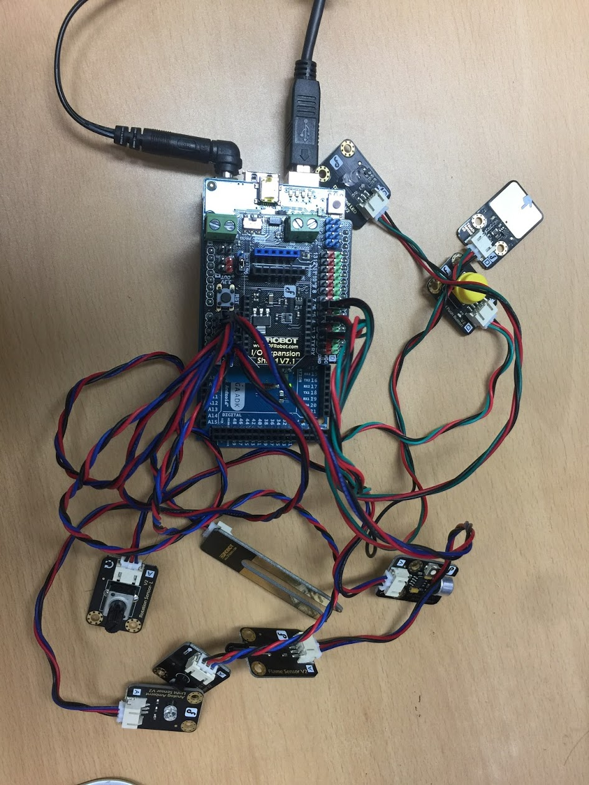

## Arduino Example
Arduino with IO Expansion Shield for Arduino V7.1. The follwing sensors are connnected to the board.
- DFRobot Digital Push Button
- DFRobot Capacitive Touch Sensor
- DFRobot Digital Red LED Light Module
- DFRobot LM35 Linear Temperature Sensor 
- DFRobot Moisture Sensor
- DFRobot Ambient Light Sensor
- DFRobot Analog Sound Sensor
- DFRobot Analog Rotation Sensor V2
- DFRobot Flame sensor

## Target board

## Motivation
This code is to make a simple sensor device.

## Installation
Just import and run.

## Tests
Tested in Arduino IDE 1.8.3

## Contributors
Jinchul Choi (spiders22v@gmail.com)

## License
Apache 2.0
